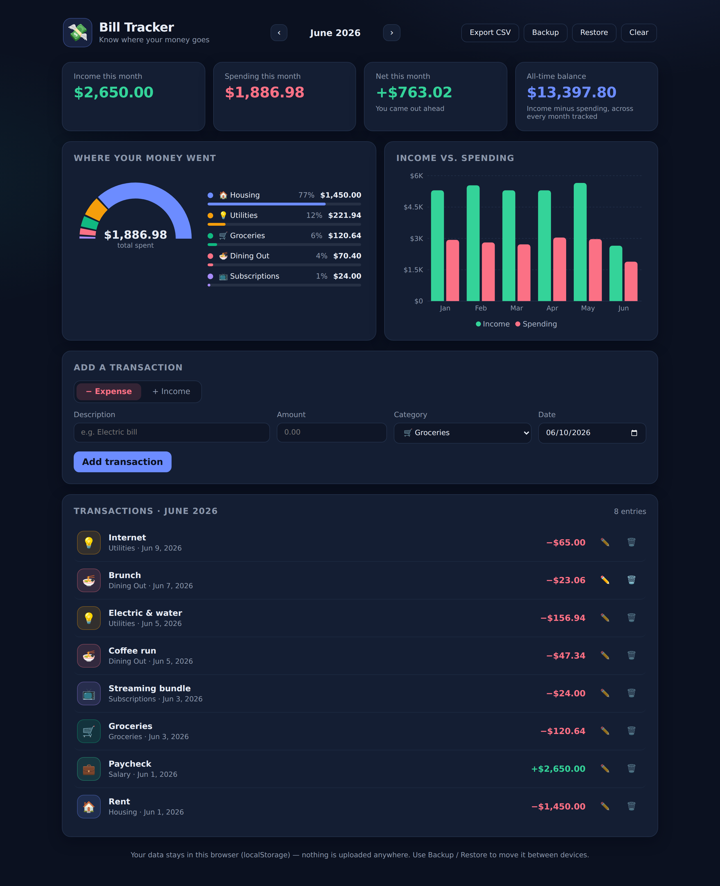

# 💸 Bill Tracker

A simple personal finance tracker that shows you where your money is going.
Log income and expenses, then watch the dashboard break it all down with
charts — no account, no server, no data leaving your browser.



## Features

- **Track everything** — log expenses and income with a description, amount,
  category, and date. Edit or delete entries anytime.
- **See where it goes** — a donut chart and ranked category breakdown show
  exactly what ate your budget each month.
- **Spot trends** — income vs. spending compared across the last six months.
- **Monthly summaries** — income, spending, net, and your all-time balance
  at a glance. Flip between months with the month picker.
- **16 built-in categories** with emoji and color coding (housing, groceries,
  dining out, subscriptions, and more).
- **Your data stays yours** — everything lives in your browser's
  localStorage. Use **Backup / Restore** (JSON) to move it between devices,
  or **Export CSV** to open it in a spreadsheet.
- **Sample data** — one click loads six months of realistic example data so
  you can explore the charts before entering your own.

## Getting started

You'll need [Node.js](https://nodejs.org) 18 or newer.

```bash
npm install
npm run dev
```

Then open the URL it prints (usually `http://localhost:5173`).

First time in, click **Load sample data** to see the dashboard in action —
**Clear** wipes it when you're ready to start tracking for real.

## Building for production

```bash
npm run build      # outputs a static site to dist/
npm run preview    # serves the built site locally
```

The `dist/` folder is fully static — host it on any static file host
(GitHub Pages, Netlify, etc.) or just open it from a local server.

## How your data is stored

Transactions are saved to `localStorage` under the key
`bill-tracker:transactions:v1`, so they persist between visits on the same
browser and device. Clearing your browser data deletes them — use the
**Backup** button to download a JSON snapshot you can **Restore** later or on
another machine.

## Tech

- [React 18](https://react.dev) + [Vite](https://vite.dev)
- [Recharts](https://recharts.org) for the charts
- Plain CSS — no framework
- Amounts are stored as integer cents to avoid floating-point rounding bugs

### Development extras

`node scripts/screenshot.mjs` runs a headless-browser smoke test against a
running preview server (`npm run preview`): it loads the app, pulls in the
sample data, fails on any console error, and saves `screenshot.png`.
